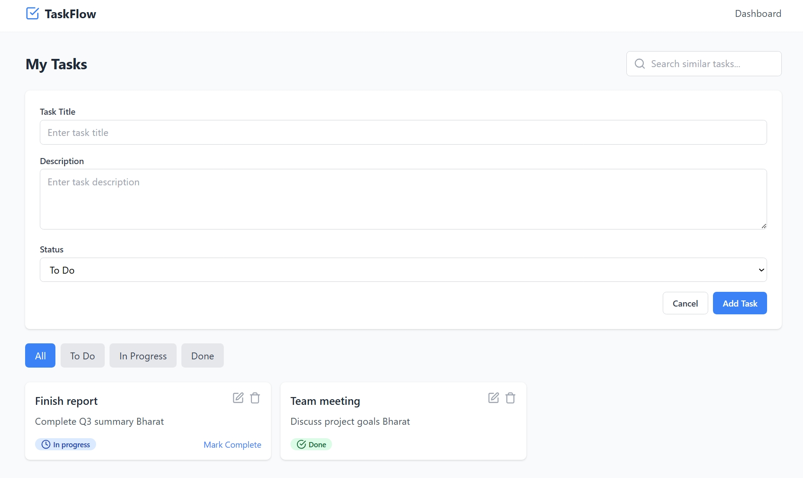

# 📝 Task Manager Web App

A full-stack **Task Management Web Application** built with React (frontend) and Express.js (backend), containerized using Docker. The app supports task CRUD operations, local caching, and semantic vector search using **pgvector** and **sentence-transformers**.

---

## 📁 Project Structure

```
task-manager-app/
├── backend/
│   ├── server.js
│   ├── routes/
│   ├── models/
│   ├── db/
│   └── Dockerfile
├── frontend/
│   ├── src/
│   │   ├── components/
│   │   └── App.jsx
│   ├── public/
│   └── Dockerfile
├── docker-compose.yml
└── README.md
```

---

## 🚀 Features

### ✅ Task 1: Dockerized Web App

- **Frontend**: Built using React
- **Backend**: Node.js with Express.js
- **Dockerized**: Docker + Docker Compose
- **Functionalities**:
  - Add, delete, and view tasks
  - Responsive UI
  - Error handling (e.g., network errors)

### 🧠 Task 2: Local Storage Caching

- Cached task data using `localStorage` to minimize server load
- Checks for cached tasks on load, falls back to server if unavailable
- Keeps local storage in sync with API

### 🔍 Task 3: Vector Search with pgvector

- Uses `sentence-transformers` to embed task descriptions
- Stores embeddings in PostgreSQL using the `pgvector` extension
- Supports semantic search for similar tasks

---

## 🛠️ Setup Instructions

### 1. Prerequisites

- Docker & Docker Compose installed
- Node.js & npm (for development mode)
- Python 3 (for vector generation)
- PostgreSQL with `pgvector` extension

---

### 2. Clone the Repository

```bash
git clone https://github.com/BharatKumawat63777/Todo-AI
cd todo
```

---

### 3. Run with Docker

```bash
docker-compose up --build
```

This will:

- Run the Express backend on `localhost:3001`
- Run the React frontend on `localhost:5174`
- Connect to PostgreSQL (with `pgvector`)

---

## ⚙️ Environment Variables

Create a `.env` file in `backend/`:

```env
SUPABASE_URL=""
SUPABASE_ANON_KEY=""
DATABASE_URL=postgresql://user:password@db:5432/tasksdb
```

---

## 🧪 API Endpoints

- `GET /api/tasks` – Get all tasks
- `POST /api/tasks` – Add new task
- `DELETE /api/tasks/:id` – Delete task
- `POST /api/search` – Vector search for tasks

---

## 💾 Caching Logic (Frontend)

```javascript
function loadTasks() {
  const cachedTasks = localStorage.getItem("tasks");
  if (cachedTasks) return JSON.parse(cachedTasks);
  return fetch("/api/tasks")
    .then(res => res.json())
    .then(tasks => {
      localStorage.setItem("tasks", JSON.stringify(tasks));
      return tasks;
    });
}

function addTask(task) {
  return fetch("/api/tasks", {
    method: "POST",
    headers: { "Content-Type": "application/json" },
    body: JSON.stringify(task)
  }).then(res => res.json())
    .then(tasks => {
      localStorage.setItem("tasks", JSON.stringify(tasks));
      return tasks;
    });
}
```

---

## 🧠 Vector Search Logic (Backend)

### Vector Generation (Python script)

```python
from sentence_transformers import SentenceTransformer
model = SentenceTransformer('all-MiniLM-L6-v2')
desc = "Complete Q3 summary"
embedding = model.encode(desc).tolist()
```

### PostgreSQL Schema

```sql
CREATE EXTENSION IF NOT EXISTS vector;
CREATE TABLE tasks (
  id SERIAL PRIMARY KEY,
  title TEXT,
  description TEXT,
  status TEXT,
  embedding VECTOR(384)
);
```

### Vector Search SQL

```sql
SELECT id, title, description, status
FROM tasks
ORDER BY embedding <-> '[EMBEDDING_VECTOR_HERE]'
LIMIT 3;
```

---

## 🌐 Optional: Offline Support

- Use **Service Workers** or **IndexedDB** to serve cached tasks when offline
- Future improvement suggestion

---

## 💡 Creative Additions

- Manual "Refresh Cache" button to sync tasks
- Status color badges (todo/in-progress/done)
- Semantic search highlighting (match score, bold keywords)

---

## 📸 Screenshots

> Add screenshots of the UI, terminal output, or search results


---


## 🤖 AI Assistance

This project was developed with the support of AI technologies like **ChatGPT**, which helped generate code snippets, design architecture, and provide best practices for building a scalable and maintainable full-stack application. Leveraging AI not only accelerated development but also inspired creative solutions such as integrating semantic vector search using embeddings, showcasing how AI can enhance software engineering workflows.


## 📜 License

MIT License © 2025 Bharat
